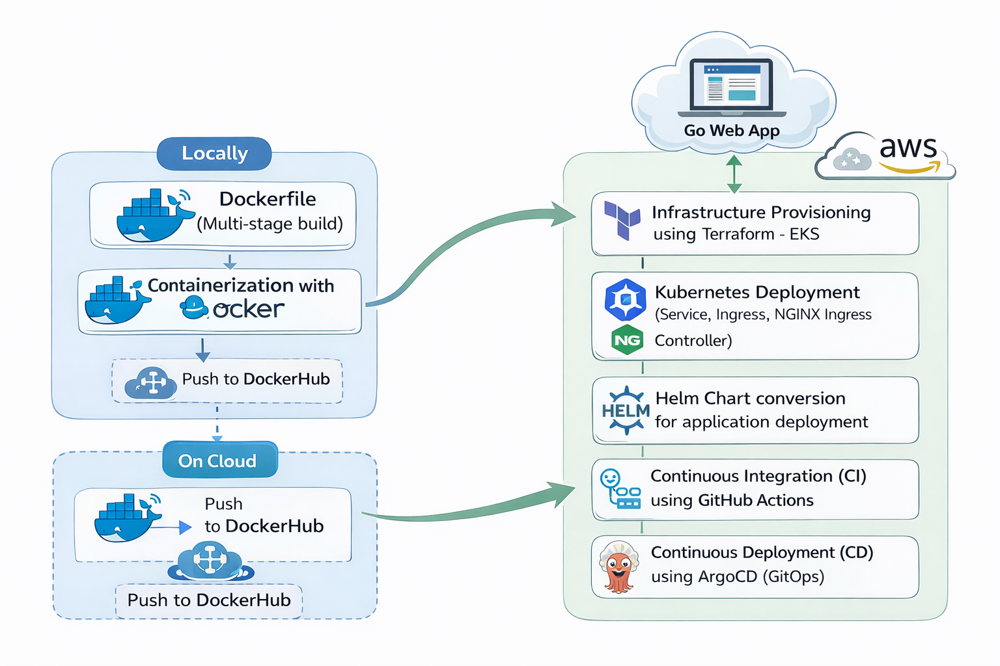
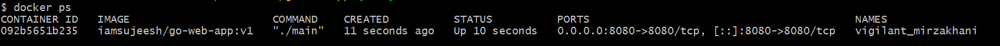
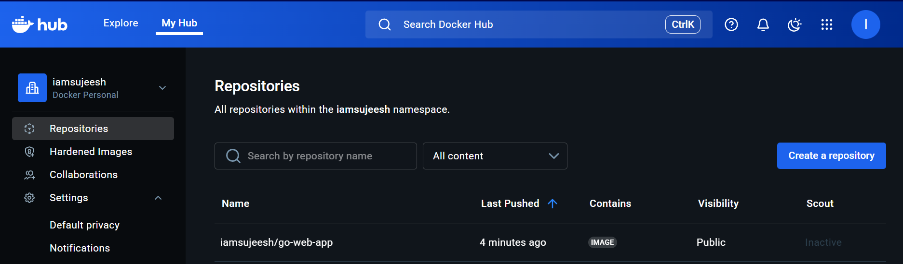
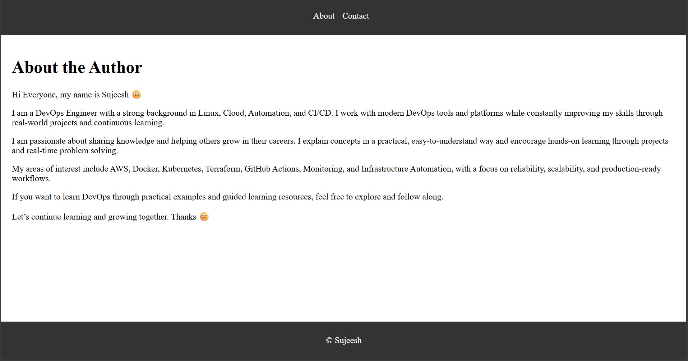
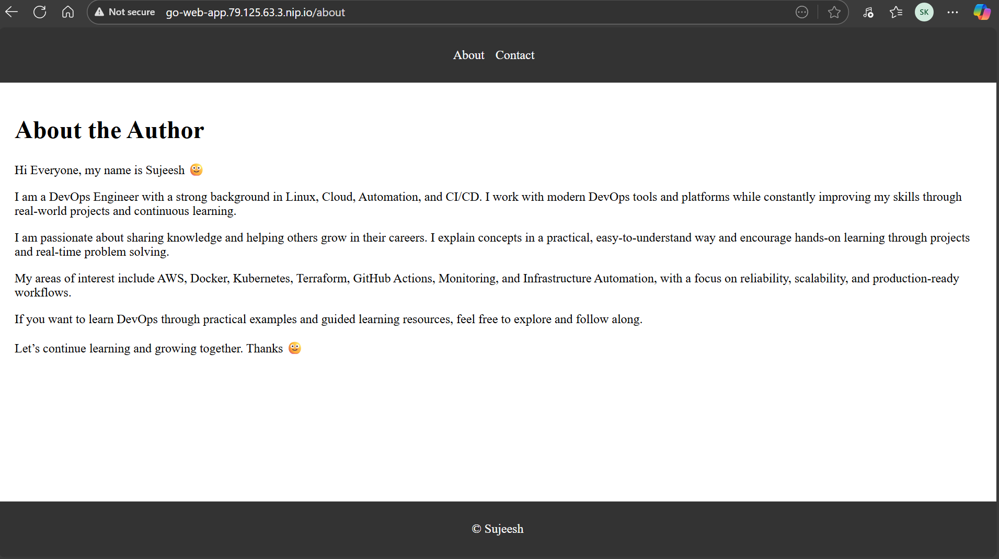
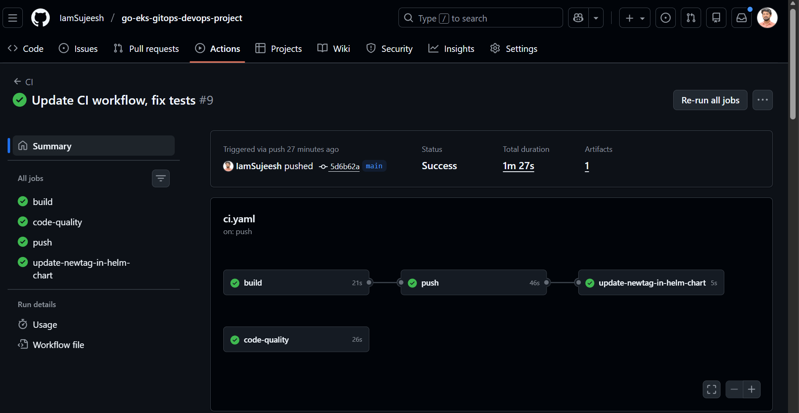
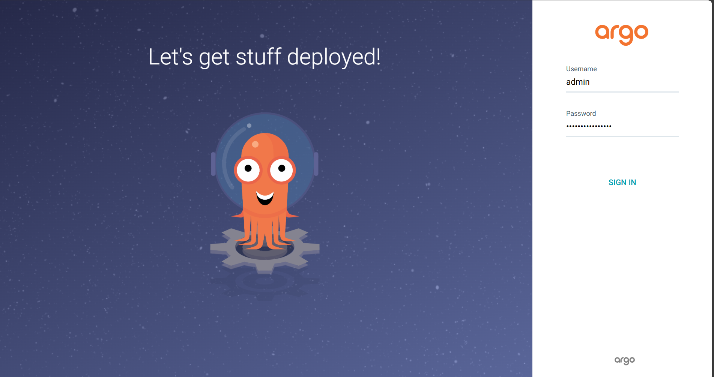
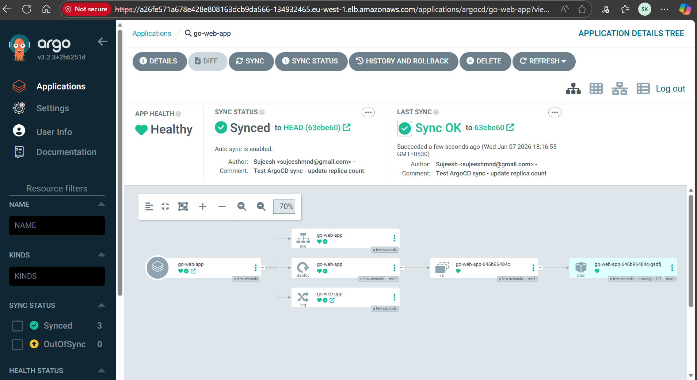

## 🚀 Project Overview

This project demonstrates a complete end-to-end DevOps workflow for a Golang web application using modern cloud-native tools.

The application is containerized using Docker, deployed on AWS EKS using Kubernetes, templated with Helm, and delivered through a fully automated CI/CD pipeline using GitHub Actions and Argo CD (GitOps).

## 🧰 Tech Stack

- Language: Go
- Containerization: Docker (Multi-stage build)
- Cloud: AWS
- IaC: Terraform
- Orchestration: Kubernetes (EKS)
- Ingress: NGINX Ingress Controller
- Packaging: Helm
- CI: GitHub Actions
- CD: Argo CD (GitOps)

## 🏗 Architecture




# Dockerfile (Multi-stage build)

The Dockerfile is used to build a Docker image. The Docker image contains the Go web application and its dependencies. The Docker image is then used to create a Docker container.

We will use a Multi-stage build to create the Docker image. The Multi-stage build is a feature of Docker that allows you to use multiple build stages in a single Dockerfile. This will reduce the size of the final Docker image and also secure the image by removing unnecessary files and packages.

# Containerization with docker

Containerization is the process of packaging an application and its dependencies into a container. The container is then run on a container platform such as Docker. Containerization allows you to run the application in a consistent environment, regardless of the underlying infrastructure.

We will use Docker to containerize the Go web application. Docker is a container platform that allows you to build, ship, and run containers.

Commands to build the Docker container:

```bash
docker build -t <your-docker-username>/go-web-app:v1 .
```

Command to run the Docker container:

```bash
docker run -p 8080:8080 <your-docker-username>/go-web-app:v1
```



Command to push the Docker container to Docker Hub:

```bash
docker push <your-docker-username>/go-web-app:v1
```




## Infrastructure Provisioning using terraform - EKS

A sample Terraform project to provision an Amazon EKS (Elastic Kubernetes Service) cluster along with the required VPC and networking components.

## Prerequisites
1️⃣ Install AWS CLI

The AWS CLI is required to authenticate Terraform with your AWS account.

Follow the official installation guide:

```text
https://docs.aws.amazon.com/cli/latest/userguide/getting-started-install.html
```

Verify the installation:

```bash
aws -version
```
```bash
$ aws --version
aws-cli/2.27.37 Python/3.13.4 Windows/11 exe/AMD64
```

After installation, configure credentials:

```text
aws configure
```
Provide:

- AWS Access Key
- AWS Secret Key
- Default Region
- Default Output Format (optional)

## Install Terraform

Install Terraform using the official guide:

```text
https://developer.hashicorp.com/terraform/tutorials/aws-get-started/install-cli
```

Verify the installation:

```bash
terraform -version
```
```bash
$ terraform -version
Terraform v1.14.3
on windows_amd64
```

## Project Setup

Clone the Repository

```bash
git clone https://github.com/iamsujeesh/go-web-app.git
```

```bash
cd terraform-eks
```

## Initialize Terraform

```bash
terraform init
```
This downloads:

- Providers
- Modules
- Backend configuration

## Review the Execution Plan

```bash
terraform plan
```
This shows the resources Terraform will create.

## Create the EKS Cluster

<details> <summary>Terraform Apply – Infrastructure Provisioning Output</summary>

</details>

Terraform provisions the following AWS resources:

VPC and subnets

Internet Gateway and NAT Gateway

Amazon EKS Cluster

Managed Worker Node Group

IAM roles and security resources

<details> <summary>EKS Cluster Details</summary>

</details> ```

## Configure kubectl Access to the Cluster

After the EKS cluster is created, you must configure cluster access so kubectl can communicate with it.

Option 1 — Configure Access via AWS Console (GUI)

- Open AWS Console → EKS
- Select your cluster
- Go to Access tab
- Add your IAM user/role to cluster access
- Assign at least admin or appropriate RBAC role
- This grants permission to access the cluster.

Option 2 — Configure Access via AWS CLI

- Update your local kubeconfig:
- aws eks update-kubeconfig --name <cluster-name> --region <region>


Verify connectivity:

```bash
kubectl get nodes
```

```text
$ kubectl get nodes
NAME                                       STATUS   ROLES    AGE     VERSION
ip-10-0-1-129.eu-west-1.compute.internal   Ready    <none>   4m54s   v1.34.2-eks-ecaa3a6
ip-10-0-2-201.eu-west-1.compute.internal   Ready    <none>   4m55s   v1.34.2-eks-ecaa3a6
```

If you see worker nodes listed — kubectl is successfully configured.

Once the EKS cluster is created and kubectl access is configured, Deploying the Application to EKS (Manual Deployment Before CI/CD)

# Kubernetes Deployment (Service, Ingress, NGINX Ingress Controller)

## Deploy Kubernetes Manifests

```bash
kubectl apply -f k8s/manifests/deployment.yaml
kubectl apply -f k8s/manifests/service.yaml       # Service initially deployed
kubectl apply -f k8s/manifests/ingress.yaml
```

```text
EAD+sk508@IN-5CD4377RNY MINGW64 ~/Downloads/go-web-app/k8s/manifests (main)
$ ls -l
total 9
-rw-r--r-- 1 EAD+sk508 4096 463 Jan  5 20:14 deployment.yaml
-rw-r--r-- 1 EAD+sk508 4096 439 Jan  1 22:54 ingress.yaml
-rw-r--r-- 1 EAD+sk508 4096 248 Jan  1 22:53 service.yaml
 
EAD+sk508@IN-5CD4377RNY MINGW64 ~/Downloads/go-web-app/k8s/manifests (main)
$ kubectl apply -f deployment.yaml 
deployment.apps/go-web-app created
 
EAD+sk508@IN-5CD4377RNY MINGW64 ~/Downloads/go-web-app/k8s/manifests (main)
$ kubectl apply -f service.yaml
service/go-web-app created
 
EAD+sk508@IN-5CD4377RNY MINGW64 ~/Downloads/go-web-app/k8s/manifests (main)
$ kubectl apply -f ingress.yaml
ingress.networking.k8s.io/go-web-app created
 
EAD+sk508@IN-5CD4377RNY MINGW64 ~/Downloads/go-web-app/k8s/manifests (main)
$ pwd
/c/Users/sk508/Downloads/go-web-app/k8s/manifests
 
EAD+sk508@IN-5CD4377RNY MINGW64 ~/Downloads/go-web-app/k8s/manifests (main)
$
```

## Validate Service Before Ingress (LoadBalancer)

- To verify the application before configuring the ingress,change type from ClusterIP to LoadBalancer

```bash
kubectl edit svc go-web-app
kubectl get svc
```

```text
$ kubectl get svc
NAME         TYPE           CLUSTER-IP     EXTERNAL-IP                                                              PORT(S)        AGE
go-web-app   LoadBalancer   172.20.97.95   a1f0b10c5e0b547839340724d0324e5e-363363908.eu-west-1.elb.amazonaws.com   80:32579/TCP   12m
kubernetes   ClusterIP      172.20.0.1     <none>                                                                   443/TCP        27m
```

- Now the service is accessible via LoadBalancer:



## Why Ingress Controller is Required

After deploying the ingress:

```bash
kubectl get ing
```

```text
$ kubectl get ing
NAME         CLASS   HOSTS              ADDRESS   PORTS   AGE
go-web-app   nginx   go-web-app.local             80      5m34s
 
EAD+sk508@IN-5CD4377RNY MINGW64 ~/Downloads/go-web-app/k8s/manifests (main)
```

The ingress shows no external address, because an Ingress Controller is needed.
The controller watches ingress resources and provisions a Load Balancer.

## Install NGINX Ingress Controller (AWS)

```bash
kubectl apply -f https://raw.githubusercontent.com/kubernetes/ingress-nginx/controller-v1.11.1/deploy/static/provider/aws/deploy.yaml
```

Verify the controller:

```bash
kubectl get pods -n ingress-nginx
```

```text
$ kubectl apply -f https://raw.githubusercontent.com/kubernetes/ingress-nginx/controller-v1.11.1/deploy/static/provider/aws/deploy.yaml
namespace/ingress-nginx created
serviceaccount/ingress-nginx created
serviceaccount/ingress-nginx-admission created
role.rbac.authorization.k8s.io/ingress-nginx created
role.rbac.authorization.k8s.io/ingress-nginx-admission created
clusterrole.rbac.authorization.k8s.io/ingress-nginx created
clusterrole.rbac.authorization.k8s.io/ingress-nginx-admission created
rolebinding.rbac.authorization.k8s.io/ingress-nginx created
rolebinding.rbac.authorization.k8s.io/ingress-nginx-admission created
clusterrolebinding.rbac.authorization.k8s.io/ingress-nginx created
clusterrolebinding.rbac.authorization.k8s.io/ingress-nginx-admission created
configmap/ingress-nginx-controller created
service/ingress-nginx-controller created
service/ingress-nginx-controller-admission created
deployment.apps/ingress-nginx-controller created
job.batch/ingress-nginx-admission-create created
job.batch/ingress-nginx-admission-patch created
ingressclass.networking.k8s.io/nginx created
validatingwebhookconfiguration.admissionregistration.k8s.io/ingress-nginx-admission created
 
EAD+sk508@IN-5CD4377RNY MINGW64 ~/Downloads/go-web-app/k8s/manifests (main)
```

- Inspect arguments (optional):

```bash
kubectl -n ingress-nginx describe deploy ingress-nginx-controller | grep -- --ingress-class
```

You’ll see:

```bash
--ingress-class=nginx
```
This means the controller watches ingress resources with class nginx.

Check ingress again:

```bash
kubectl get ing
```

```text
$ kubectl get ing
NAME         CLASS   HOSTS              ADDRESS                                                                         PORTS   AGE
go-web-app   nginx   go-web-app.local   a4654764fbeeb41019e0c55dafdd86bf-c2d5fad58258c05b.elb.eu-west-1.amazonaws.com   80      10m
```

Now an AWS Network Load Balancer (NLB) is provisioned automatically.

## Map Load Balancer IP to a Temporary Hostname (nip.io)

- For testing Kubernetes Ingress without updating DNS, we use nip.io, a free wildcard DNS service.

What is nip.io?

nip.io automatically maps any IP address embedded in a hostname to that IP.
For example:

```text
go-web-app.79.125.63.3.nip.io
```

resolves to 79.125.63.3 automatically — no DNS setup or hosts file editing required.

Steps to Access the App

Check your Ingress:

```bash
kubectl get ingress
```

```text
$ kubectl get ing
NAME         CLASS   HOSTS              ADDRESS                                                                         PORTS   AGE
go-web-app   nginx   go-web-app.local   a4654764fbeeb41019e0c55dafdd86bf-c2d5fad58258c05b.elb.eu-west-1.amazonaws.com   80      10m
```

Verify the NLB / Load Balancer DNS or IP:

```bash
nslookup <NLB-DNS>
```

```text
$ nslookup a4654764fbeeb41019e0c55dafdd86bf-c2d5fad58258c05b.elb.eu-west-1.amazonaws.com
Server:  RTK_GW.domain.name
Address:  192.168.1.1
 
Non-authoritative answer:
Name:    a4654764fbeeb41019e0c55dafdd86bf-c2d5fad58258c05b.elb.eu-west-1.amazonaws.com
Addresses:  79.125.63.3 
          18.202.184.239
```

Update your Ingress host (example):

```text
host: go-web-app.<LOAD_BALANCER_IP>.nip.io
```
then

```bash
kubectl apply -f ingress.yaml
```

Access the app in your browser:

```text
http://go-web-app.79.125.63.3.nip.io/about
```

The request will route through the Ingress Controller to your service and pods.



# Helm chart conversion for application deployment

- Helm is used to templatize and parameterize the Kubernetes manifests.

## Create Helm Chart

- Install Helm

Run the following command to install Helm:

```bash
curl -fsSL https://raw.githubusercontent.com/helm/helm/main/scripts/get-helm-3 | bash
helm version
```
```text
$ helm version
version.BuildInfo{Version:"v4.0.4", GitCommit:"8650e1dad9e6ae38b41f60b712af9218a0d8cc11", GitTreeState:"clean", GoVersion:"go1.25.5", KubeClientVersion:"v1.34"}
```

```bash
mkdir helm
```
```bash
cd helm
```
```bash
helm create go-web-app-chart
```
```bash
cd go-web-app-chart
```
Remove default files:

```bash
rm -rf charts
cd templates
rm -rf *
```

Copy all Kubernetes manifests into templates/

## Parameterize Image in Deployment

In deployment.yaml, update:

```bash
image: iamsujeesh/go-web-app:{{ .Values.image.tag }}
```

Now the image tag comes from values.yaml.

Edit values.yaml and simplify to:

```bash
image:
  tag: v1
```

## Remove Old Resources & Deploy via Helm

Delete old manifests:

```bash
kubectl delete deploy <name>
kubectl delete svc <name>
kubectl delete ing <name>
```

Install Helm release:

```bash
cd ..
helm install go-web-app go-web-app-chart
```

```text
$ helm install go-web-app go-web-app-chart/
NAME: go-web-app
LAST DEPLOYED: Tue Jan  6 23:14:21 2026
NAMESPACE: default
STATUS: deployed
REVISION: 1
DESCRIPTION: Install complete
TEST SUITE: None
```


Verify:

```bash
kubectl get all
```
```text
$ kubectl get all
NAME                             READY   STATUS    RESTARTS   AGE
pod/go-web-app-c876cff96-nlfpd   1/1     Running   0          90s
 
NAME                 TYPE        CLUSTER-IP       EXTERNAL-IP   PORT(S)   AGE
service/go-web-app   ClusterIP   172.20.232.109   <none>        80/TCP    90s
service/kubernetes   ClusterIP   172.20.0.1       <none>        443/TCP   54m
 
NAME                         READY   UP-TO-DATE   AVAILABLE   AGE
deployment.apps/go-web-app   1/1     1            1           91s
 
NAME                                   DESIRED   CURRENT   READY   AGE
replicaset.apps/go-web-app-c876cff96   1         1         1       91s
```

Uninstall release if needed:

```bash
helm uninstall go webapp go-web-app-chart
```

## Summary (What This Workflow Demonstrates)

- Manual deployment using kubectl
- LoadBalanacer testing before ingress
- The NGINX ingress controller runs inside the cluster-It watches ingress resources
- For each ingress rule, it creates a Load Balancer on AWS
- Map Load Balancer IP to a Temporary Hostname (nip.io)
- The Load Balancer receives traffic → forwards to Service → Pods
- Converting manifests to a Helm chart


# Continuous Integration (CI) using GitHub Actions

Continuous Integration (CI) is the practice of automatically building, testing, and validating application changes whenever code is pushed to a shared repository. CI helps detect issues early and ensures every commit remains in a deployable state.

In this project, CI is implemented using GitHub Actions, which allows us to automate workflows such as building the application, running tests, performing code quality checks, and publishing container images.

CI Pipeline Tasks

- The CI pipeline performs the following steps:
- Build and unit test the Go application
- Run static code analysis
- Build a Docker image and push it to Docker Hub
- Automatically update the Helm chart with the new image tag whenever a commit is made

# Continuous Deployment (CD) using ArgoCD (GitOps)

Continuous Deployment (CD) is the practice of automatically deploying application changes to the target environment once they pass CI validation. CD reduces deployment delays and enables faster delivery of new features and fixes.

This project uses Argo CD, a declarative GitOps-based CD tool for Kubernetes. Argo CD continuously monitors the Git repository and ensures the Kubernetes cluster state always matches the repository state.

CD Workflow

- Argo CD watches the Helm chart repository
- Whenever the CI pipeline updates the Helm values (new image tag)
- Argo CD detects the change and automatically syncs the deployment to the Kubernetes cluster


## CI Implementation (GitHub Actions Workflow)

Create the workflow file:

```bash
.github/workflows/ci.yaml
```

```yaml
name: CI

# Exclude the workflow to run on changes to the helm chart
on:
  push:
    branches:
      - main
    paths-ignore:
      - 'helm/**'
      - 'k8s/**'
      - 'README.md'

jobs:

  build:
    runs-on: ubuntu-latest

    steps:
    - name: Checkout repository
      uses: actions/checkout@v4

    - name: Set up Go 1.22
      uses: actions/setup-go@v2
      with:
        go-version: 1.22

    - name: Build
      run: go build -o go-web-app

    - name: Test
      run: go test ./...
  
  code-quality:
    runs-on: ubuntu-latest

    steps:
    - name: Checkout repository
      uses: actions/checkout@v4

    - name: Run golangci-lint
      uses: golangci/golangci-lint-action@v6
      with:
        version: v1.56.2
  
  push:
    runs-on: ubuntu-latest

    needs: build

    steps:
    - name: Checkout repository
      uses: actions/checkout@v4

    - name: Set up Docker Buildx
      uses: docker/setup-buildx-action@v1

    - name: Login to DockerHub
      uses: docker/login-action@v3
      with:
        username: ${{ secrets.DOCKERHUB_USERNAME }}
        password: ${{ secrets.DOCKERHUB_TOKEN }}

    - name: Build and Push action
      uses: docker/build-push-action@v6
      with:
        context: .
        file: ./Dockerfile
        push: true
        tags: ${{ secrets.DOCKERHUB_USERNAME }}/go-web-app:${{github.run_id}}

  update-newtag-in-helm-chart:
    runs-on: ubuntu-latest

    needs: push

    steps:
    - name: Checkout repository
      uses: actions/checkout@v4
      with:
        token: ${{ secrets.TOKEN }}

    - name: Update tag in Helm chart
      run: |
        sed -i 's/tag: .*/tag: "${{github.run_id}}"/' helm/go-web-app-chart/values.yaml

    - name: Commit and push changes
      run: |
        git config --global user.email "sujeeshmnd@gmail.com"
        git config --global user.name "Sujeesh K"
        git add helm/go-web-app-chart/values.yaml
        git commit -m "Update tag in Helm chart"
        git push
```


🔐 Configure GitHub Action Secrets

Before running the CI pipeline, you must add three secrets in your GitHub repository:

Go to:

```text
GitHub → Repository → Settings → Secrets and variables → Actions → New repository secret
```

1️⃣ DOCKERHUB_USERNAME

Your Docker Hub username

Used by the pipeline to authenticate and push Docker images.

2️⃣ DOCKERHUB_TOKEN

A Docker Hub Access Token

```text
 Docker Hub → Account Settings → Security → New Access Token
```

Purpose: Allows GitHub Actions to log in to Docker Hub and push images securely.

3️⃣ TOKEN

GitHub Personal Access Token (PAT) with repo permissions.

```text
GitHub → Settings → Developer settings → Personal access tokens → Fine-grained token
```

Give minimum required permissions:

```text
Repository → Contents → Read & Write
```

Purpose: Used to auto-commit updated Helm chart image tags back to your repository during CI.


Push changes from local:

```bash
git status
git add .
git commit -m "Your commit message"
git branch -M main
git remote add origin https://github.com/IamSujeesh/go-eks-gitops-devops-project.git
git push -u origin main

``` 
You can monitor pipeline execution in the GitHub Actions tab.




## CD Implementation (Argo CD)

every time ci pipeline runs ,ArgoCD has to identify the change and push it to k8s cluster

# Install Argo CD

Install Argo CD using manifests

```bash
kubectl create namespace argocd
kubectl apply -n argocd -f https://raw.githubusercontent.com/argoproj/argo-cd/stable/manifests/install.yaml
```

## Access the Argo CD UI (Loadbalancer service) 

After the CI pipeline publishes the new image tag and updates the Helm chart, Argo CD detects the change and deploys the latest version to the EKS cluster.

Install Argo CD

```bash
kubectl create namespace argocd
kubectl apply -n argocd -f https://raw.githubusercontent.com/argoproj/argo-cd/stable/manifests/install.yaml
```

Expose Argo CD UI via LoadBalancer

```bash
kubectl patch svc argocd-server -n argocd -p '{"spec": {"type": "LoadBalancer"}}'
```
```bash
kubectl get svc argocd-server -n argocd
kubectl get nodes -o wide
```
```text
$ kubectl get svc argocd-server -n argocd
NAME            TYPE           CLUSTER-IP       EXTERNAL-IP                                                          
    PORT(S)                      AGE
argocd-server   LoadBalancer   172.20.120.186   a26fe571a678e428e808163dcb9da566-134932465.eu-west-1.elb.amazonaws.com   80:31628/TCP,443:30490/TCP   37s

$ kubectl get nodes -o wide
NAME                                       STATUS   ROLES    AGE   VERSION               INTERNAL-IP   EXTERNAL-IP      OS-IMAGE                       KERNEL-VERSION                   CONTAINER-RUNTIME
ip-10-0-4-44.eu-west-1.compute.internal    Ready    <none>   16m   v1.34.2-eks-ecaa3a6   10.0.4.44     34.246.162.219   Amazon Linux 2023.9.20251208   6.12.58-82.121.amzn2023.x86_64   containerd://2.1.5
ip-10-0-5-161.eu-west-1.compute.internal   Ready    <none>   16m   v1.34.2-eks-ecaa3a6   10.0.5.161    54.77.249.61     Amazon Linux 2023.9.20251208   6.12.58-82.121.amzn2023.x86_64   containerd://2.1.5
```

- user name is admin
- Access the UI using the external LoadBalancer IP (or NodePort if preferred)

Retrieve Argo CD Admin Password

```bash
kubectl get secrets -n argocd
kubectl edit secret argocd-initial-admin-secret -n argocd
``` 
- copy the base64 encodes password from the opened file
- Retrieve Argo CD Admin Password

```bash
echo < base64 encoded password > |base64 --decode
```

Login credentials:

- Username: admin
- Password: (decoded output above)



## 🎯 Create Argo CD Application

In the UI:

- Click New App
- Application Name: go-web-app
- Project Name: default
- Sync Policy: Automatic + Enable auto-sync Self-Heal
- Repository URL: (Git repo URL)
- Path: helm/go-web-app-chart
- Destination- select existing
- Namespace: default
- Select values.yaml
- Click Create

Argo CD will:

- Continuously monitor the Helm chart
- Detect image tag updates from CI
- Automatically sync and deploy the latest version



```text
$ kubectl get deploy
NAME         READY   UP-TO-DATE   AVAILABLE   AGE
go-web-app   1/1     1            1           5m18s
 
$
 
$ kubectl get svc
NAME         TYPE        CLUSTER-IP       EXTERNAL-IP   PORT(S)   AGE
go-web-app   ClusterIP   172.20.178.244   <none>        80/TCP    5m26s
kubernetes   ClusterIP   172.20.0.1       <none>        443/TCP   102m
 
EAD+sk508@IN-5CD4377RNY MINGW64 ~/Downloads/go-eks-gitops-devops-project (main)
$
 
$ kubectl get ing
NAME         CLASS   HOSTS                              ADDRESS                                                                         PORTS   AGE
go-web-app   nginx   go-web-app.52.211.105.252.nip.io   a82ca37a823da403fabac42f265603a0-f3a41eb9da4da3c3.elb.eu-west-1.amazonaws.com   80      5m32s
 
EAD+sk508@IN-5CD4377RNY MINGW64 ~/Downloads/go-eks-gitops-devops-project (main)
$
```


## 📌 Key Learnings

- Implemented GitOps-based CD using Argo CD with automatic self-healing
- Designed production-style Kubernetes networking using Ingress and NLB
- Automated Docker image build and Helm value updates via GitHub Actions
- Used Terraform to provision scalable EKS infrastructure
- Understood real-world CI/CD separation and responsibility boundaries
